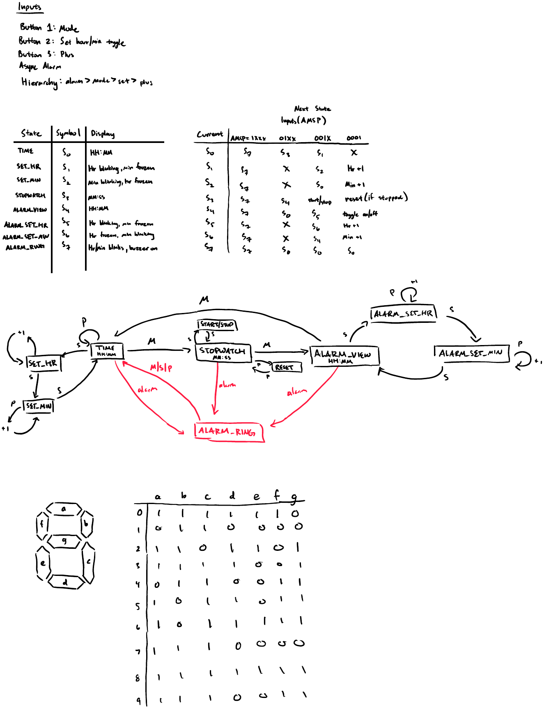

# Watch-FSM

A digital watch built as a finite state machine (FSM) in SystemVerilog — designed and simulated first, with implementation on an FPGA board and a custom low-power PCB in progress.

## Overview

A top-level FSM (`TIME`, `STOPWATCH`, `ALARM_VIEW`, `ALARM_RING`, each with their own set-mode sub-states) drives a multi-mode watch supporting:

- Time display and time-setting (with a blinking digit pair while setting)
- Stopwatch
- Alarm (view, set, and ring — one-shot edge-detected trigger, silenced by any button press)
- Seven-segment digit decoding, driven straight off the watch's internal time/alarm/stopwatch registers
- Debounced physical button inputs

Three buttons (Mode / Set / Plus) are reused contextually across modes, plus an internally-derived alarm trigger. Simultaneous inputs are resolved deterministically with a priority-encoded scheme: **alarm > mode > set > plus (AMSP)**.



See [`state_diagrams.pdf`](./docs/state_diagrams.pdf) for the full-resolution/zoomable version.

## Design

- A modular, parameterized RTL datapath — a generic mod-N wraparound counter — is reused across the time, stopwatch, and alarm fields rather than duplicating counter logic per field.
- Each function lives in its own file with its own self-checking testbench: `mod_counter.sv`, `time_keeper.sv`, `stopwatch.sv`, `alarm_view.sv`, `clock.sv`, `debouncer.sv`, `display.sv`, and `watch.sv` (top-level).
- `debouncer.sv` filters the three raw button lines with a counter-based debounce (consecutive-cycle threshold) before they ever reach the FSM; `watch.sv` then edge-detects the cleaned signals into single-cycle pulses.
- `display.sv` decodes the watch's two BCD-style digit-pair registers into four independent 7-segment outputs (`top_tens_7sd`, `top_ones_7sd`, `bottom_tens_7sd`, `bottom_ones_7sd`) via `case`/`localparam` lookup tables, avoiding hand-derived Karnaugh maps. A dedicated out-of-range sentinel value (`6'b111111`) blanks a digit pair — used to drive the blinking display in the set-hr/set-min sub-states and during `ALARM_RING`.
- `tick_1Hz` and `blink_en` (the 2Hz blink-rate signal) are currently top-level inputs to `watch.sv`, generated by the testbench in simulation. Real-hardware generation of both is planned for the PCB stage (see Next Steps).

## Design Decisions & Debugging

A few of the more interesting bugs caught during simulation, since the fixes aren't visible from just reading the final code:

- **Missing `always_comb` default caused a double-step bug.** `watch.sv`'s top-level FSM originally had no default assignment for `next_state` before its transition `case`, which left `next_state` implicitly latched between updates. A single button press was walking the FSM through two states in one clock cycle instead of one. Root-caused with detailed `$monitor` tracing that exposed a transient delta-cycle window where the state register and a pulse-generator register were momentarily out of sync. Fixed by making `next_state = state;` the very first statement in the block — and specifically *before* the `trigger_alarm` check, since a first attempt at the fix placed the default after that check, which would have silently overwritten any alarm-triggered transition into `ALARM_RING`.
- **Blocking vs. non-blocking assignment bug in `clock.sv`'s reset logic.** The synchronous reset block used a blocking assignment (`state = 2'b00`) inside an `always_ff`, which works by accident in simple cases but breaks the intended register-transfer semantics and can cause race conditions as logic is added around it. Caught by code review rather than simulation, then confirmed fixed.
- **A self-clearing asynchronous reset feedback loop.** The factory-reset signal (`fact_rst = b_mode & b_set & b_plus`) was originally wired into the `areset` port of the same button debouncers that feed into it, creating a combinational loop back on itself. Simulation showed `fact_rst` asserting for exactly one delta-cycle before clearing itself — confirmed by predicting the exact failure timestamp from the debounce threshold and matching it against the simulator's output to the picosecond. Downstream registers still reset correctly (they only need to see the edge), but `fact_rst` itself was never observably held high. Fixed by removing the `areset` port from `debouncer.sv` entirely rather than tying it off, since the debouncers don't need their own reset path.

## Testing

Each module has a self-checking SystemVerilog testbench (`tb_*.sv`) run under [Icarus Verilog](http://iverilog.icarus.com/), exercising reset, wraparound, and edge-triggered event behavior. `tb_watch.sv` is the top-level integration testbench, covering the full AMSP priority scheme, mode cycling, factory reset, alarm arm/trigger/silence, blinking display behavior, and a direct sweep of `display.sv`'s 7-segment decoding (every valid digit-pair value, the blink/blank sentinel, and out-of-range fallback).

**418 automated checks, 0 failures, across all 6 testbenches:**

| Testbench | Checks |
|---|---|
| `tb_mod_counter.sv` | 14 |
| `tb_stopwatch.sv` | 10 |
| `tb_time_keeper.sv` | 18 |
| `tb_clock.sv` | 33 |
| `tb_alarm_view.sv` | 49 |
| `tb_watch.sv` (top-level integration) | 294 |

```bash
make          # build and run all testbenches
```

(Developed in VS Code with the Icarus Verilog toolchain.)

## Status

- [x] FSM design and simulation (SystemVerilog / Icarus Verilog)
- [x] Button debouncing
- [x] Seven-segment display decoding
- [ ] Blink-rate (`blink_en`) hardware generation
- [ ] Real-time base (`tick_1Hz`) hardware generation
- [ ] FPGA board bring-up
- [ ] Custom low-power PCB

## Next Steps / Missing Features

- **`blink_en` generator**: needs a real counter-based divider bringing a reference clock down to 2Hz (the same style of divide-down as `debouncer.sv`'s counter, or a divider tap off the eventual crystal circuit) — a naive both-edges toggle on the raw system clock was tried and reverted, since it doesn't actually divide the frequency down and dual-edge-triggered flip-flops aren't standard practice in synthesizable RTL.
- **`tick_1Hz` real-time base**: deferred to the PCB stage — planned as a 32.768kHz watch crystal driving a 15-stage binary divider (bit 14 tap = 1Hz), as an alternative to a less-accurate 555 timer astable circuit.
- **Buzzer driver circuit**: deferred to the PCB stage (schematic/KiCad work, not RTL).
- **Dedicated `tb_display.sv`**: `display.sv`'s decoding is currently exercised from within `tb_watch.sv` by forcing its inputs directly; a standalone testbench would keep it independently runnable/regression-friendly as the rest of the design changes.
- **FPGA board bring-up**: validate the design against real button/display hardware before committing to the custom PCB.
- **Custom low-power PCB (KiCad)**: schematic and layout work, including the crystal oscillator and buzzer driver circuits above.

## Tools

SystemVerilog, Icarus Verilog, VS Code, KiCad (planned)
